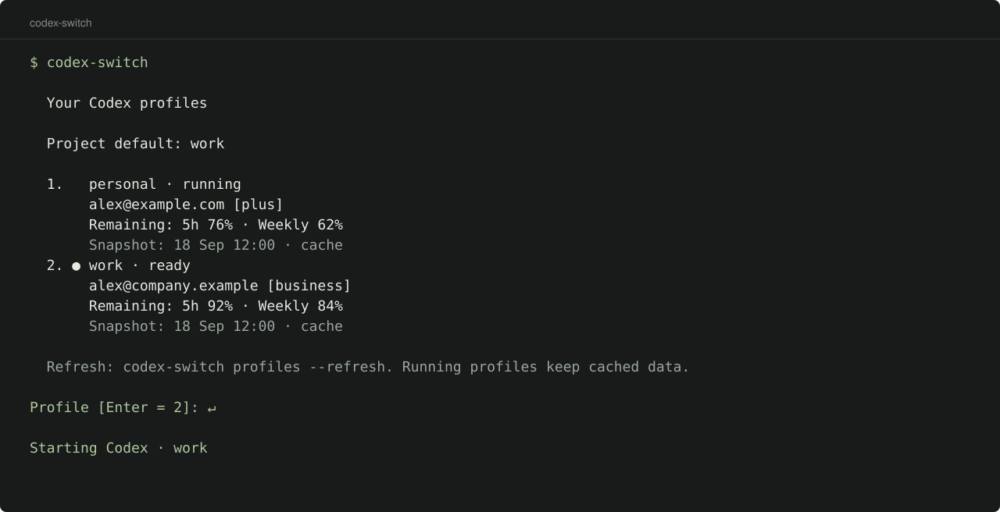

<p align="center">
  
</p>

<p align="center">
  <a href="https://github.com/blankmeta/codex-switch/actions/workflows/tests.yml"></a>
  <a href="https://github.com/blankmeta/codex-switch/tags"></a>
  <a href="https://github.com/blankmeta/homebrew-tap"></a>
  
</p>

<p align="center">
  Your ChatGPT accounts, usage limits, and project profiles for Codex.
</p>

<p align="center">
  <a href="docs/usage.md">Documentation</a> ·
  <a href="docs/architecture.md">Architecture & tests</a> ·
  <a href="docs/README.ru.md">Русский</a>
</p>

## Install & run

```sh
brew install blankmeta/tap/codex-switch
codex-switch
```

Follow the setup prompts and sign in. Add a work profile with `codex-switch login work`, then run `codex-switch bind work` in your project. Press **Enter** to use its saved profile.

Different profiles can run at the same time with separate sign-in and history. [Profiles and migration →](docs/profiles.md)

<p align="center">
  
  <br><sub>CLI preview with synthetic accounts.</sub>
</p>

## Commands

| Run | To… |
| :--- | :--- |
| `codex-switch` | Choose an account and start Codex |
| `codex-switch login work` | Add an isolated ChatGPT account |
| `codex-switch profiles --refresh` | Check current usage limits |
| `codex-switch bind work` | Remember this project’s profile |
| `codex-switch setup` | Change the connection |

Usage figures are cached snapshots. One Codex process runs per profile; other profiles can run alongside it. Original accounts and history remain available through `codex-switch legacy`.

[All commands](docs/usage.md) · [JSON & terminal integrations](docs/integrations.md) · [Changelog](CHANGELOG.md)

**Need a proxy?** Run `codex-switch setup` and paste a VLESS link. The proxy applies to launched processes. See [connection settings and all commands](docs/usage.md).

---

<p align="center">
  Built on <a href="https://github.com/Loongphy/codex-auth">codex-auth</a>,
  <a href="https://github.com/openai/codex">Codex CLI</a>, and
  <a href="https://github.com/XTLS/Xray-core">Xray-core</a>.<br>
  <sub>Previously codex-vpn. An independent project, unaffiliated with OpenAI. Dependencies retain their own licenses.</sub>
</p>
