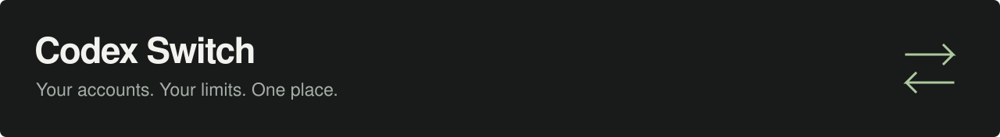

<p align="center">
  
</p>

<p align="center">
  <a href="https://github.com/blankmeta/codex-switch/actions/workflows/tests.yml"></a>
  <a href="https://github.com/blankmeta/codex-switch/tags"></a>
  <a href="https://github.com/blankmeta/homebrew-tap"></a>
  
</p>

<p align="center">
  Switch ChatGPT accounts and check usage limits before launching Codex.
</p>

<p align="center">
  <a href="docs/usage.md">Documentation</a> ·
  <a href="docs/architecture.md">Architecture & tests</a> ·
  <a href="docs/README.ru.md">Русский</a>
</p>

## Install & run

```sh
brew install blankmeta/tap/codex-switch
codex-switch
```

Follow the setup prompts, then type an account number to start Codex. Press **Enter** to keep the selected account.

<p align="center">
  
  <br><sub>Real CLI output with fictional accounts.</sub>
</p>

## Commands

| Run | To… |
| :--- | :--- |
| `codex-switch` | Choose an account and start Codex |
| `codex-switch login` | Add a ChatGPT account |
| `codex-switch accounts --refresh` | Check current usage limits |
| `codex-switch resume` | Choose an account and resume Codex |
| `codex-switch setup` | Change the connection |

Usage figures are cached snapshots of five-hour and weekly allowances. Refresh them with the command above. Restart existing Codex sessions after switching accounts.

**Need a proxy?** Run `codex-switch setup` and paste a VLESS link. The proxy applies to launched processes. See [connection settings and all commands](docs/usage.md).

---

<p align="center">
  Built on <a href="https://github.com/Loongphy/codex-auth">codex-auth</a>,
  <a href="https://github.com/openai/codex">Codex CLI</a>, and
  <a href="https://github.com/XTLS/Xray-core">Xray-core</a>.<br>
  <sub>Previously codex-vpn. An independent project, unaffiliated with OpenAI. Dependencies retain their own licenses.</sub>
</p>
