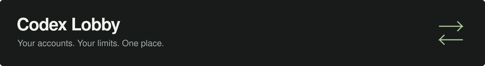
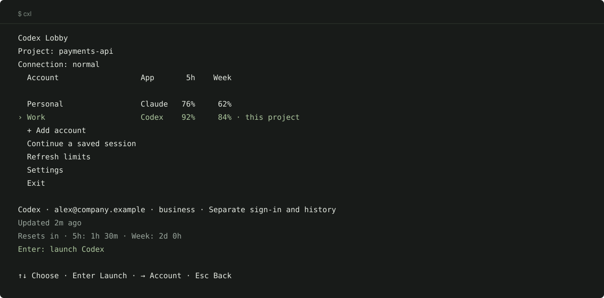

<p align="center">
  
</p>

<p align="center">
  <a href="https://github.com/blankmeta/codex-lobby/actions/workflows/tests.yml"></a>
  <a href="https://github.com/blankmeta/codex-lobby/tags"></a>
  <a href="https://github.com/blankmeta/homebrew-tap"></a>
  
</p>

<p align="center">
  Your Codex and Claude accounts, remaining limits, and sessions in one terminal menu.
</p>

<p align="center">
  <a href="docs/usage.md">Documentation</a> ·
  <a href="docs/architecture.md">Architecture & tests</a> ·
  <a href="docs/README.ru.md">Русский</a>
</p>

## Install & run

**macOS**

```sh
brew install blankmeta/tap/codex-lobby
```

**Linux**

```sh
curl -fsSL https://raw.githubusercontent.com/blankmeta/codex-lobby/main/install.sh | sh
```

**Windows · PowerShell**

```powershell
irm https://raw.githubusercontent.com/blankmeta/codex-lobby/main/install.ps1 | iex
```

Then run **`cxl`**. Choose **Add account → ChatGPT or Claude**, and sign in in your browser. Missing tools install automatically. No profile names or configuration files to fill in.

Next time: choose an account with **↑↓**, press **Enter**. **→** opens account actions. [Installation details](docs/install.md)

<p align="center">
  
  <br><sub>CLI preview with synthetic accounts.</sub>
</p>

## Your accounts, ready to work

| What you need | Where to find it |
| :--- | :--- |
| **Work and personal side by side** | Separate sign-in and history for each added account |
| **The right account for a project** | Settings → Account for this project; then Enter to launch |
| **See what remains** | Five-hour and weekly limits, reset times, and data age |
| **Pick up your work** | Continue a saved session |
| **Connect with VLESS** | Settings → Connection → paste your link |

Different accounts run concurrently; one agent process runs per added account. Original accounts stay in the same list with their original history. [Accounts & migration →](docs/profiles.md)

Limits show saved data with its age. **Refresh limits** updates Codex; Claude reports limits while you use it. Unknown values stay `—`. Accounts never rotate automatically.

**Need a proxy before sign-in?** Choose connection setup on the first screen, or run `codex-lobby setup`. Paste a VLESS link; the app checks it and connects. Proxy use is optional.

[Menu & commands](docs/usage.md) · [JSON & terminal integrations](docs/integrations.md) · [Changelog](CHANGELOG.md)

---

<p align="center">
  Built on <a href="https://github.com/Loongphy/codex-auth">codex-auth</a>,
  <a href="https://github.com/openai/codex">Codex CLI</a>,
  <a href="https://code.claude.com/docs">Claude Code</a>, and
  <a href="https://github.com/XTLS/Xray-core">Xray-core</a>.<br>
  <sub>Previously Codex Switch / codex-vpn. An independent project, unaffiliated with OpenAI or Anthropic. Dependencies retain their own licenses.</sub>
</p>
