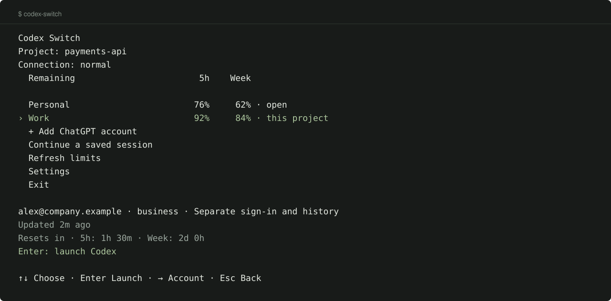

<p align="center">
  
</p>

<p align="center">
  <a href="https://github.com/blankmeta/codex-switch/actions/workflows/tests.yml"></a>
  <a href="https://github.com/blankmeta/codex-switch/tags"></a>
  <a href="https://github.com/blankmeta/homebrew-tap"></a>
  
</p>

<p align="center">
  Your ChatGPT accounts, remaining limits, and Codex sessions in one terminal menu.
</p>

<p align="center">
  <a href="docs/usage.md">Documentation</a> ·
  <a href="docs/architecture.md">Architecture & tests</a> ·
  <a href="docs/README.ru.md">Русский</a>
</p>

## Install & run

```sh
brew install blankmeta/tap/codex-switch
codex-switch
```

Choose **Add ChatGPT account** and sign in in your browser. Codex starts when you return. No account names or configuration files to fill in.

Next time, choose an account with **↑↓** and press **Enter**. Add another account, check limits, or open settings from the same menu.

<p align="center">
  
  <br><sub>CLI preview with synthetic accounts.</sub>
</p>

## Your accounts, ready to work

| What you need | Where to find it |
| :--- | :--- |
| **Work and personal side by side** | Separate sign-in and history for each added account |
| **The right account for a project** | Settings → Account for this project; then Enter to launch |
| **See what remains** | Five-hour and weekly limits, reset times, and data age |
| **Pick up your work** | Continue a saved session |
| **Connect with VLESS** | Settings → Connection → paste your link |

Different accounts run concurrently; one Codex process runs per added account. Original accounts stay in the same list with their original history. [Accounts & migration →](docs/profiles.md)

Limits show saved data with its age. Choose **Refresh limits** to update idle accounts. Accounts never rotate automatically.

**Need a proxy before sign-in?** Choose connection setup on the first screen, or run `codex-switch setup`. Paste a VLESS link; the app checks it and connects. Proxy use is optional.

[Menu & commands](docs/usage.md) · [JSON & terminal integrations](docs/integrations.md) · [Changelog](CHANGELOG.md)

---

<p align="center">
  Built on <a href="https://github.com/Loongphy/codex-auth">codex-auth</a>,
  <a href="https://github.com/openai/codex">Codex CLI</a>, and
  <a href="https://github.com/XTLS/Xray-core">Xray-core</a>.<br>
  <sub>Previously codex-vpn. An independent project, unaffiliated with OpenAI. Dependencies retain their own licenses.</sub>
</p>
