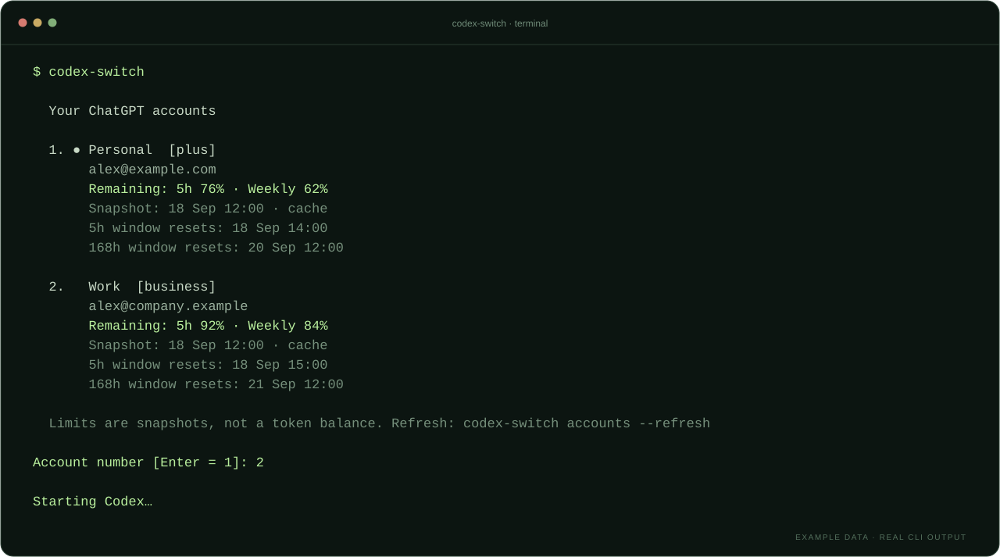

<p align="center">
  
</p>

<p align="center">
  <a href="https://github.com/blankmeta/codex-switch/actions/workflows/tests.yml"></a>
  <a href="https://github.com/blankmeta/codex-switch/tags"></a>
  <a href="https://github.com/blankmeta/homebrew-tap"></a>
  
</p>

<p align="center">
  Switch between your ChatGPT accounts, check usage limits, and start Codex.<br>
  <strong>A terminal account picker with an optional VLESS connection.</strong>
</p>

<p align="center">
  <a href="#quick-start">Quick start</a> ·
  <a href="#a-look-inside">Preview</a> ·
  <a href="#commands">Commands</a> ·
  <a href="docs/architecture.md">Architecture</a> ·
  <a href="docs/README.ru.md">Русский</a>
</p>

<br>

## Quick start

```sh
brew install blankmeta/tap/codex-switch
```

Then open the account picker:

```sh
codex-switch
```

**Homebrew takes care of the dependencies.** On your first launch, choose a normal connection or paste a VLESS link, sign in to ChatGPT if needed, and pick an account. On later launches, press **Enter** to keep the selected account or type another account's number.

Already using `codex-auth` or the original `codex-vpn`? Your saved accounts and VLESS settings are detected automatically.

## A look inside

<p align="center">
  
</p>

<p align="center"><sub>Real CLI formatting, fictional accounts. Your snapshot and reset times appear when available.</sub></p>

<details>
<summary>View the example as text</summary>

```text
  Your ChatGPT accounts

  1. ● Personal  [plus]
       alex@example.com
       Remaining: 5h 76% · Weekly 62%

  2.   Work  [business]
       alex@company.example
       Remaining: 5h 92% · Weekly 84%

Account number [Enter = 1]: 2

Starting Codex…
```

Shortened for readability. The full output also includes data freshness and available reset times.

</details>

<br>

<table>
<tr>
<td width="50%" valign="top">
<h3>⇄ &nbsp; Your accounts, together</h3>
Choose a saved ChatGPT account before starting Codex. Add another with <code>codex-switch login</code>, or pick an account when resuming a session.
</td>
<td width="50%" valign="top">
<h3>◷ &nbsp; Usage at a glance</h3>
See remaining five-hour and weekly allowances, snapshot dates, and reset times. Missing data appears as <code>—</code>.
</td>
</tr>
<tr>
<td width="50%" valign="top">
<h3>⌘ &nbsp; Guided first launch</h3>
Install with Homebrew and follow the terminal prompts. The package includes Codex CLI and codex-auth. English and Russian prompts are available.
</td>
<td width="50%" valign="top">
<h3>↗ &nbsp; VLESS when you need it</h3>
Paste a provider link to connect through Xray. The proxy applies to launched processes; your system VPN and routing keep their settings.
</td>
</tr>
</table>

> [!NOTE]
> Account selection applies to new Codex sessions. Restart existing sessions to use another account. Usage percentages describe allowances in time windows; they are not a token balance. The picker uses local or cached data unless you request a refresh.

## Commands

| I want to… | Run |
| :--- | :--- |
| **Choose an account and start Codex** | `codex-switch` |
| Add another ChatGPT account | `codex-switch login` |
| See accounts and saved limits | `codex-switch accounts` |
| Refresh limits from OpenAI | `codex-switch accounts --refresh` |
| Select an account without starting Codex | `codex-switch switch` |
| Choose an account and resume Codex | `codex-switch resume` |
| Set up or change the connection | `codex-switch setup` |
| Check installation and connectivity | `codex-switch doctor` |
| Stop the proxy, keeping saved settings | `codex-switch stop` |

Pass arguments to Codex with `codex-switch -- <arguments>`. The old `codex-vpn` command remains available.

<details>
<summary><strong>Русский интерфейс / Russian prompts</strong></summary>

```sh
CODEX_SWITCH_LANG=ru codex-switch
```

Для добавления аккаунта используй `codex-switch login`, для настройки подключения — `codex-switch setup`.

[Полная инструкция на русском →](docs/README.ru.md)

</details>

## Optional VLESS connection

Run `codex-switch setup`, choose **VLESS**, and paste your provider's link. Xray starts when you launch Codex.

| Security | Transports |
| :--- | :--- |
| TLS · REALITY | TCP · WebSocket · gRPC · XHTTP · HTTPUpgrade |

Transport and security combinations must be compatible. The setup validates the link with Xray before saving it. Finish sessions using the current proxy and run `codex-switch stop` before changing VLESS servers.

<details>
<summary><strong>Configuration, credentials, and compatibility</strong></summary>

| Setting | Location / value |
| :--- | :--- |
| Application configuration | `~/.config/codex-switch/` |
| Existing VLESS configuration | Read from `~/.config/xray-codex/servers.json` |
| ChatGPT credentials | Managed by codex-auth / Codex |
| Default proxy address | `http://127.0.0.1:10810` |
| Custom application directory | `CODEX_SWITCH_HOME` |
| Custom proxy port | `CODEX_PROXY_PORT` |
| Interface language | `CODEX_SWITCH_LANG=en` or `ru` |

A custom `CODEX_SWITCH_HOME` isolates application settings and disables legacy import. Existing VLESS files stay in place. The launcher passes proxy settings to child processes without editing shell startup files or macOS network settings.

`accounts --refresh` asks codex-auth to retrieve usage data from OpenAI. Authentication errors ask you to sign in again; cached data retains its snapshot time. This launcher does not rotate accounts automatically or bypass usage limits.

The core `codex-proxy` commands remain available: `--set-vless`, `--run`, `--list`, `--status`, and `--stop`. The [original unmodified wrapper](https://github.com/blankmeta/codex-switch/tree/v1.0.0) remains available in the first release tag. The current launcher focuses on account selection and direct VLESS setup rather than the original subscription and GUI environment helpers.

</details>

## Built to be testable

The application separates domain rules, use cases, adapters, and terminal presentation. Tests enforce the import boundaries.

```text
src/codex_switch/
├── domain/          Accounts, usage windows, VLESS validation
├── application/     Use cases and dependency protocols
├── infrastructure/  codex-auth, Xray, storage, subprocesses
├── presentation/    Terminal prompts and commands
└── bootstrap.py     Adapter wiring
```

**37 tests** cover domain and application behavior, adapter contracts, storage, a real local VLESS tunnel, account switching with synthetic credentials, and a complete first-run CLI scenario. CI runs on Linux and macOS. The Homebrew package also has an installation smoke test.

<details>
<summary><strong>Run the tests</strong></summary>

Python 3.11+; no third-party Python runtime dependencies.

```sh
PYTHONPATH=src python3 -m unittest discover -s tests -t . -v
```

Some integration tests require Xray or codex-auth 0.3.0 and explicit environment flags. See [Architecture and tests](docs/architecture.md) for the full commands and test pyramid.

</details>

<details>
<summary><strong>Contributing</strong></summary>

[Open an issue](https://github.com/blankmeta/codex-switch/issues) with your macOS version, the command you ran, and the behavior you expected. Redact email addresses, VLESS links, and credentials from shared output.

For a pull request, keep domain rules free of I/O, implement external behavior behind application protocols, and include a test for the behavior you change. Run the suite before submitting.

</details>

<br>

---

<p align="center">
  Built on <a href="https://github.com/Loongphy/codex-auth">codex-auth</a>,
  <a href="https://github.com/openai/codex">Codex CLI</a>, and
  <a href="https://github.com/XTLS/Xray-core">Xray-core</a>.<br>
  <sub>Previously codex-vpn. An independent project, unaffiliated with OpenAI. Dependencies retain their own licenses.</sub>
</p>
