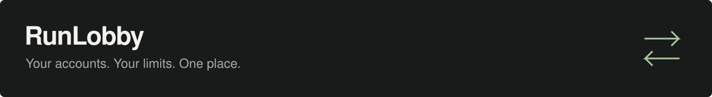
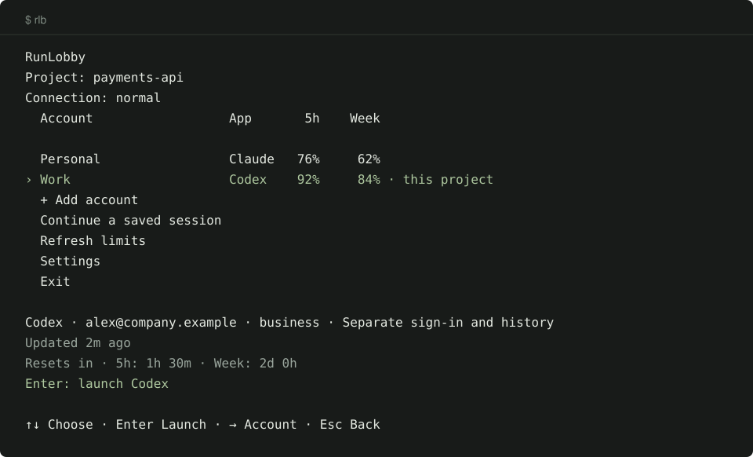

<p align="center">
  
</p>

<p align="center">
  Твои аккаунты <strong>Codex и Claude</strong> в одном меню.<br>
  Посмотри остатки лимитов, выбери аккаунт и продолжай работу.
</p>

<p align="center">
  <a href="#начать-работу">Начать работу</a> · <a href="usage.md">Инструкция</a> · <a href="../README.md">English</a>
</p>

<p align="center">
  
  <br><sub>Пример меню. Аккаунты вымышленные, проценты показывают остатки лимитов.</sub>
</p>

## Начать работу

**1. Установи для своей системы**

macOS · Homebrew

```sh
brew install blankmeta/tap/runlobby
```

Linux

```sh
curl -fsSL https://raw.githubusercontent.com/blankmeta/runlobby/main/install.sh | sh
```

Windows · PowerShell

```powershell
irm https://raw.githubusercontent.com/blankmeta/runlobby/main/install.ps1 | iex
```

[Требования к системе, обновление и другие способы установки →](install.md)

**2. Открой RunLobby и войди**

```sh
rlb
```

Выбери **Добавить аккаунт → ChatGPT или Claude** и войди в браузере. Недостающие инструменты RunLobby установит сам.

Дальше выбирай аккаунт стрелками **↑↓** и нажимай **Enter**, чтобы начать работу. **→** открывает действия аккаунта, **Esc** возвращает назад.

Русский интерфейс включается в **Settings → Language / Язык**. Приложение сохранит выбор.

## Работа с аккаунтами

| Тебе нужно… | В RunLobby |
| :--- | :--- |
| **Разделить рабочее и личное** | Добавь оба аккаунта: у каждого отдельный вход и история |
| **Запомнить аккаунт проекта** | Выбери аккаунт, нажми **→**, затем **Выбирать для этого проекта** |
| **Вернуться к разговору** | **Продолжить сохранённую сессию** → выбери аккаунт |
| **Подключиться через прокси** | **Настройки → Подключение** → вставь VLESS-ссылку |

Рядом с аккаунтами видны остатки за пять часов и неделю. Ниже указаны время восстановления и свежесть данных. **Обновить лимиты** запрашивает данные Codex. Claude передаёт показатели во время работы; `—` означает отсутствие данных. [Подробнее о лимитах →](usage.md#usage-limits)

Для входа через прокси выбери **Настроить подключение / вставить VLESS** на первом экране.

## Видно, чем занят агент

Выбери аккаунт и начни работу. Слева — твой агент, справа — **панель активности**
на 20% ширины терминала. Включена сразу, дополнительных запросов к модели нет.

- **Топ-10 действий** — чтение кода, правки, тесты, проверка CI и другие наблюдаемые операции.
- **Токены, кэш и время инструментов** — **F10** меняет сортировку.
- **История сессий** — открой **Сессии · анализ действий**, чтобы посмотреть предыдущую работу и результаты инструментов.

**F8** скрывает панель; **F9** выбирает сессию, если её не удалось определить автоматически.
**Настройки → Панель статистики** или `rlb monitor off` / `rlb monitor on` сохраняют выбор для следующих запусков.
Работает через встроенный PTY/ConPTY на macOS, Linux и Windows.

Локальные журналы проверяются каждые **250 мс**. Счётчики обновляются по мере записи
событий агентом. Токены включают кэш; это отдельная статистика, не лимиты подписки.
[Методика классификации и подсчёта →](activity-methodology.md)

<details>
<summary>Прежние аккаунты и совместимость</summary>

Аккаунты из Codex Switch и Codex Lobby остаются в списке со своей историей. Прежние команды, включая `cxl`, сохраняются; короткая команда RunLobby — `rlb`.

Разные добавленные аккаунты можно запускать в отдельных терминалах. На один аккаунт допускается один работающий процесс. Ты сам выбираешь аккаунт; автоматического переключения нет.

[Аккаунты и перенос](profiles.md) · [Команды и JSON](integrations.md)

</details>

<details>
<summary>Архитектура и новые провайдеры</summary>

Codex и Claude реализуют общий интерфейс провайдера. Для нового сервиса добавь адаптер и зарегистрируй его. Отдельные адаптеры Windows, macOS и Linux отвечают за клавиатуру, пути и блокировки процессов.

[Архитектура и тесты](architecture.md) · [Добавление провайдера](providers.md) · [Изменения](../CHANGELOG.md)

</details>

---

Используем [Codex CLI](https://github.com/openai/codex), [Claude Code](https://code.claude.com/docs), [codex-auth](https://github.com/Loongphy/codex-auth) и [Xray](https://github.com/XTLS/Xray-core).

[Лицензия MIT](../LICENSE). Независимый проект, не связан с OpenAI и Anthropic. У зависимостей свои лицензии.
