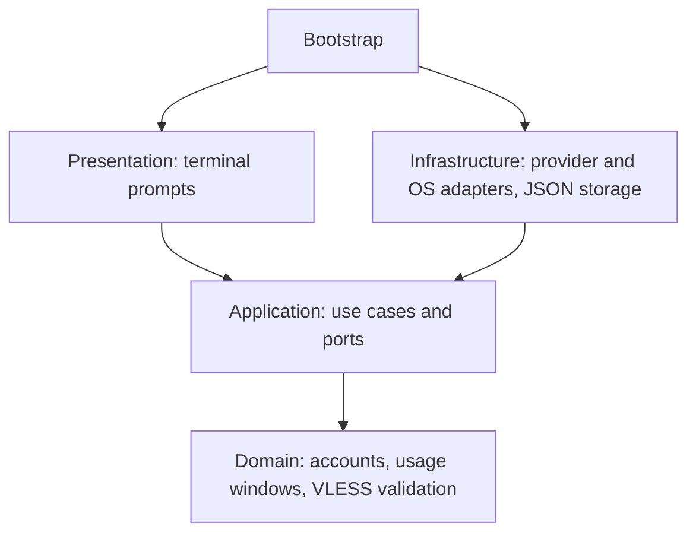

# Architecture

`bootstrap.py` is the composition root. It wires adapters into application ports.



| Layer | Responsibility | Side effects |
| --- | --- | --- |
| `domain` | Immutable account/server models, quota math, VLESS parsing | None |
| `application` | Connection setup, account selection, ordered launch | Only through injected protocols |
| `infrastructure` | Atomic private files, codex-auth JSON, Xray processes, Codex process | Filesystem and subprocesses |
| `presentation` | Menu state, pure frame renderer, arrow/number input, EN/RU text, commands | Terminal input/output |

The legacy launch use case resolves the connection, confirms the global account switch, then starts Codex. Managed launches validate the profile and arguments, resolve connectivity, and delegate to the profile runtime. They never call the global account switcher. Cached status does not start a proxy or request API data.

Xray listens on loopback. Switching to normal connectivity changes future launches without killing existing proxy sessions. The connection menu asks before replacing a live server, tests the new connection, and restores the previous preference after a failed check. Process shutdown verifies both the executable and the configuration path before sending a signal.

Settings writes use mode `0600`, a temporary file, `fsync`, and atomic replacement. Server updates and Xray lifecycle changes use file locks. Legacy VLESS files are read without overwriting them. Codex performs OAuth in a fresh staged home. Managed login validates account metadata through codex-auth, then publishes the new home or atomically replaces the authenticated file on re-login. Tokens are not decoded by this project or emitted in status. Legacy accounts remain managed by codex-auth.

## Providers and platforms

`AgentProvider` and `ProviderRegistry` separate account/session behavior from storage and UI. Codex and Claude implement the same contract. `ProviderInfo` supplies menu labels, tool requirements and usage capabilities. [Add another provider](providers.md).

`application/platform_ports.py` defines `FileLocks`, `Lease`, `TerminalInput`, `AppPaths` and `ProcessControl`. macOS and Linux share POSIX locks and terminal input, with separate path policies. Windows implements exclusive inherited file handles and native console events. Process adapters use psutil for executable/configuration identity and PID-reuse protection; detached process creation differs by OS. Proxy HTTP checks use the Python standard library instead of OS-specific curl paths.

The terminal renderer only consumes normalized keys. It never imports `termios`, `fcntl`, Win32 APIs or infrastructure. The composition root supplies its native terminal adapter. Native process-lock tests terminate the wrapper while the actual Codex app-server stays alive and verify a competing launch remains blocked, on all three operating systems.

Private JSON files use UTF-8 explicitly. Unix permissions are 0600/0700; Windows inherits user-directory ACLs. Existing account paths survive the product rename. Standalone native bundles include Python and psutil; provider tools install separately from pinned official archives after checksum verification.

## Managed profiles

`Profiles` and `Projects` are application ports. Domain rules validate names and reject identity/storage overrides. `LocalProfiles` owns directory operations, subprocesses, and private snapshots. `JsonProjects` stores canonical project-root preferences outside repositories. Presentation formats these models without importing adapters.

A nonblocking native lock covers each managed profile for the duration of login, API refresh, or launch. The native agent child inherits the POSIX descriptor or exclusive Win32 handle, so terminating only its wrapper does not release the lock. Different profiles use different locks. One profile supports one running agent process in this release; external tools do not participate in this locking protocol.

Sign-in uses a staging directory and checks the account identity before publishing credentials. Reauthentication preserves history. Runtime homes and SQLite homes are per-profile. The launcher does not copy the original user's Codex configuration or refresh tokens.

Status uses a saved metadata snapshot when a profile is locked. A malformed profile becomes an error row instead of hiding other profiles. JSON schema version 1 exposes account display data and usage, never raw credentials.

## Session observation

`domain/activity.py` contains deterministic classification and accounting rules.
`SessionAnalysis` consumes a session repository port; local adapters tail Codex
and Claude JSONL and link subagents. They never execute transcript commands or
call a model. Presentation shares the same category labels and statistics between
the history menu and the live panel.

`LiveRunner` wraps agent launches only. POSIX PTY and Windows ConPTY adapters
transport terminal bytes behind `PseudoTerminal`; the virtual screen composes
the agent with a separate sidebar. Account locks remain held by the agent child:
POSIX inherits the descriptor, while ConPTY receives a duplicated Win32 handle.
Authentication and usage-fetch subprocesses keep their ordinary execution path.

Native integration tests launch actual PTY/ConPTY children, send input, resize
the terminal, check exit status and account leases, and append synthetic logs
while the panel runs. No user credentials or paid model calls are needed.

## Tests

The pyramid consists of fast unit tests for domain rules and use cases, adapter contract tests with controlled subprocess results, filesystem and real dependency integration tests, and complete CLI scenarios with substitute external binaries. Managed-profile tests cover two simultaneous subprocesses, wrapper termination with a surviving child, cancelled/wrong-account sign-in, duplicate identities, private storage, and project bindings.

The architecture test rejects outward imports from the domain and application layers and infrastructure imports from the presentation layer.

UX tests cover project defaults, original-account visibility, duplicate sign-in, inline recovery, exhausted limits, connection rollback, naming and removal confirmation. Pseudo-terminal tests send actual arrow/Enter/Escape sequences through the CLI, launch a child against temporary account homes, and verify terminal mode restoration. The README preview uses the same frame renderer as the interactive menu.

```sh
PYTHONPATH=src python3 -m unittest discover -s tests -t . -v
```

To include the local Xray tunnel and real codex-auth tests:

```sh
PYTHONPATH=src CODEX_SWITCH_NETWORK_TESTS=1 \
  CODEX_SWITCH_TEST_AUTH_BINARY="$(command -v codex-auth)" \
  python3 -m unittest discover -s tests -t . -v
```

Use codex-auth 0.3.0 for the integration test. Optionally set `CODEX_SWITCH_TEST_CODEX_BINARY` to test synthetic profiles with real Codex `login status` and `--version` (no model requests). The test creates synthetic credentials in a temporary Codex home and blocks outbound proxy traffic. It does not switch your real account. Xray tests use an HTTP target and a VLESS server on loopback, with their own ports and settings.

## Contributing

Python 3.11+ and psutil. CI runs on Windows, Linux and macOS, including native console and process tests. The Homebrew formula includes an installation smoke test.

[Open an issue](https://github.com/blankmeta/runlobby/issues) with your OS version, the command you ran, and the behavior you expected. Redact email addresses, VLESS links, and credentials from shared output.

For a pull request, keep domain rules free of I/O, implement external behavior behind application protocols, and include a test for the behavior you change. Run the suite before submitting.
