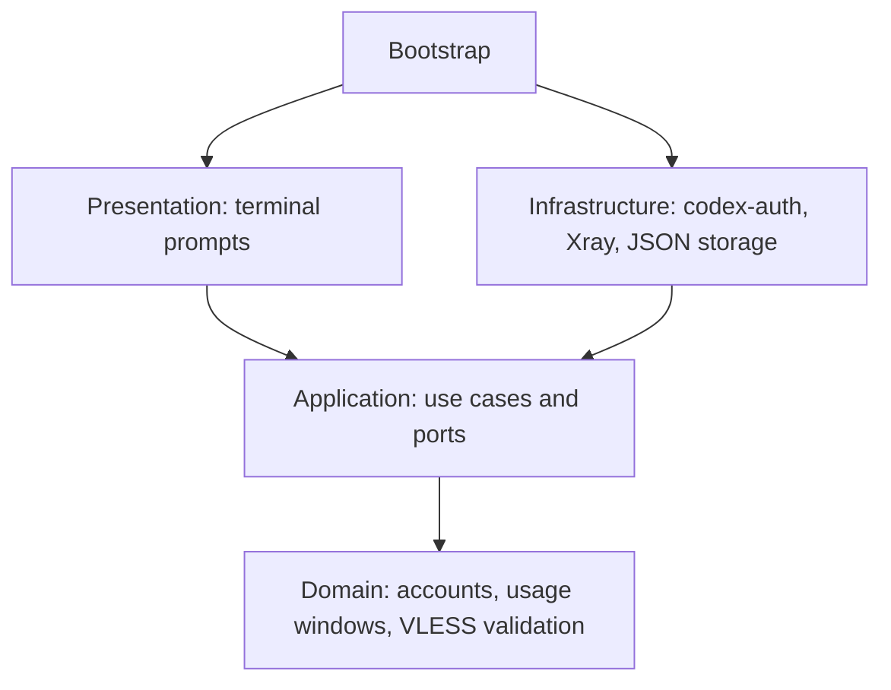

# Architecture

`bootstrap.py` is the composition root. It wires adapters into application ports.



| Layer | Responsibility | Side effects |
| --- | --- | --- |
| `domain` | Immutable account/server models, quota math, VLESS parsing | None |
| `application` | Connection setup, account selection, ordered launch | Only through injected protocols |
| `infrastructure` | Atomic private files, codex-auth JSON, Xray processes, Codex process | Filesystem and subprocesses |
| `presentation` | Numbered choices, EN/RU text, commands | Terminal input/output |

The launch use case resolves the connection before changing the account, confirms the switch, then starts Codex. A failure at either earlier step prevents launch. Cached account listing does not start a proxy or request API data.

Xray listens on loopback. Switching to normal connectivity changes future launches without killing existing proxy sessions. Choosing a different VLESS server while another is running requires `codex-switch stop`; the application never silently replaces a proxy used by another session. Process shutdown verifies both the executable and the configuration path before sending a signal.

Settings writes use mode `0600`, a temporary file, `fsync`, and atomic replacement. Server updates and Xray lifecycle changes use file locks. Legacy VLESS files are read without overwriting them. codex-auth owns account credentials; this project consumes its versioned JSON interface and never handles raw account tokens.

## Tests

The pyramid consists of fast unit tests for domain rules and use cases, adapter contract tests with controlled subprocess results, filesystem and real dependency integration tests, and one complete CLI first-run scenario with substitute external binaries.

The architecture test rejects outward imports from the domain and application layers and infrastructure imports from the presentation layer.

```sh
PYTHONPATH=src python3 -m unittest discover -s tests -t . -v
```

To include the local Xray tunnel and real codex-auth tests:

```sh
PYTHONPATH=src CODEX_SWITCH_NETWORK_TESTS=1 \
  CODEX_SWITCH_TEST_AUTH_BINARY="$(command -v codex-auth)" \
  python3 -m unittest discover -s tests -t . -v
```

Use codex-auth 0.3.0 for the integration test. The test creates synthetic credentials in a temporary Codex home and blocks outbound proxy traffic. It does not switch your real account. Xray tests use an HTTP target and a VLESS server on loopback, with their own ports and settings.

## Contributing

Python 3.11+; no third-party Python runtime dependencies. CI runs on Linux and macOS. The Homebrew formula includes an installation smoke test.

[Open an issue](https://github.com/blankmeta/codex-switch/issues) with your macOS version, the command you ran, and the behavior you expected. Redact email addresses, VLESS links, and credentials from shared output.

For a pull request, keep domain rules free of I/O, implement external behavior behind application protocols, and include a test for the behavior you change. Run the suite before submitting.
