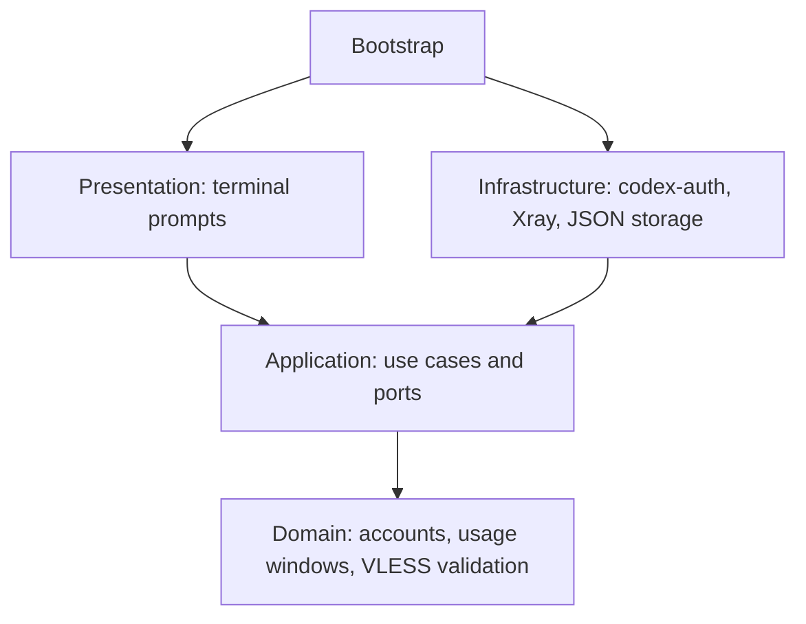

# Architecture

`bootstrap.py` is the composition root. It wires adapters into application ports.



| Layer | Responsibility | Side effects |
| --- | --- | --- |
| `domain` | Immutable account/server models, quota math, VLESS parsing | None |
| `application` | Connection setup, account selection, ordered launch | Only through injected protocols |
| `infrastructure` | Atomic private files, codex-auth JSON, Xray processes, Codex process | Filesystem and subprocesses |
| `presentation` | Numbered choices, EN/RU text, commands | Terminal input/output |

The legacy launch use case resolves the connection, confirms the global account switch, then starts Codex. Managed launches validate the profile and arguments, resolve connectivity, and delegate to the profile runtime. They never call the global account switcher. Cached status does not start a proxy or request API data.

Xray listens on loopback. Switching to normal connectivity changes future launches without killing existing proxy sessions. Choosing a different VLESS server while another is running requires `codex-switch stop`; the application never silently replaces a proxy used by another session. Process shutdown verifies both the executable and the configuration path before sending a signal.

Settings writes use mode `0600`, a temporary file, `fsync`, and atomic replacement. Server updates and Xray lifecycle changes use file locks. Legacy VLESS files are read without overwriting them. Codex performs OAuth in a fresh staged home. Managed login validates account metadata through codex-auth, then publishes the new home or atomically replaces the authenticated file on re-login. Tokens are not decoded by this project or emitted in status. Legacy accounts remain managed by codex-auth.

## Managed profiles

`Profiles` and `Projects` are application ports. Domain rules validate names and reject identity/storage overrides. `LocalProfiles` owns directory operations, subprocesses, and private snapshots. `JsonProjects` stores canonical project-root preferences outside repositories. Presentation formats these models without importing adapters.

A nonblocking advisory lock covers each managed profile for the duration of login, API refresh, or launch. The Codex child inherits the descriptor, so terminating only its wrapper does not release the lock. Different profiles use different locks. One profile supports one running process in this release; external tools do not participate in this locking protocol.

Sign-in uses a staging directory and checks the account identity before publishing credentials. Reauthentication preserves history. Runtime homes and SQLite homes are per-profile. The launcher does not copy the original user's Codex configuration or refresh tokens.

Status uses a saved metadata snapshot when a profile is locked. A malformed profile becomes an error row instead of hiding other profiles. JSON schema version 1 exposes account display data and usage, never raw credentials.

## Tests

The pyramid consists of fast unit tests for domain rules and use cases, adapter contract tests with controlled subprocess results, filesystem and real dependency integration tests, and complete CLI scenarios with substitute external binaries. Managed-profile tests cover two simultaneous subprocesses, wrapper termination with a surviving child, cancelled/wrong-account sign-in, duplicate identities, private storage, and project bindings.

The architecture test rejects outward imports from the domain and application layers and infrastructure imports from the presentation layer.

```sh
PYTHONPATH=src python3 -m unittest discover -s tests -t . -v
```

To include the local Xray tunnel and real codex-auth tests:

```sh
PYTHONPATH=src CODEX_SWITCH_NETWORK_TESTS=1 \
  CODEX_SWITCH_TEST_AUTH_BINARY="$(command -v codex-auth)" \
  python3 -m unittest discover -s tests -t . -v
```

Use codex-auth 0.3.0 for the integration test. Optionally set `CODEX_SWITCH_TEST_CODEX_BINARY` to test synthetic profiles with real Codex `login status` and `--version` (no model requests). The test creates synthetic credentials in a temporary Codex home and blocks outbound proxy traffic. It does not switch your real account. Xray tests use an HTTP target and a VLESS server on loopback, with their own ports and settings.

## Contributing

Python 3.11+; no third-party Python runtime dependencies. CI runs on Linux and macOS. The Homebrew formula includes an installation smoke test.

[Open an issue](https://github.com/blankmeta/codex-switch/issues) with your macOS version, the command you ran, and the behavior you expected. Redact email addresses, VLESS links, and credentials from shared output.

For a pull request, keep domain rules free of I/O, implement external behavior behind application protocols, and include a test for the behavior you change. Run the suite before submitting.
